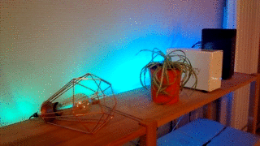
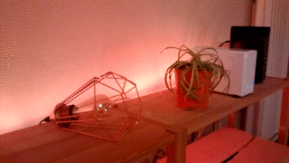
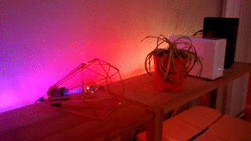

# AtmoLight

Ambiance lighting system

## What it looks like

  

  

  

## How it works

Atmolight is build around the FreeRTOS operating system and FastLED library.

There are 2 main parts:
 * **Display**: handles the logic to create the visual animations.
 * **Io**: handles external communication (currently through buttons, why not networking in the future).

## What is needed to make it work

 * An Arduino compatible board
 * Basic electronic parts (2 buttons, resistors, wires)
 * A LED strip compatible with FastLED (such as [Neopixel](https://learn.adafruit.com/adafruit-neopixel-uberguide/basic-connections))
 * FreeRTOS and Fastled libraries (can be installed using the library manager)
